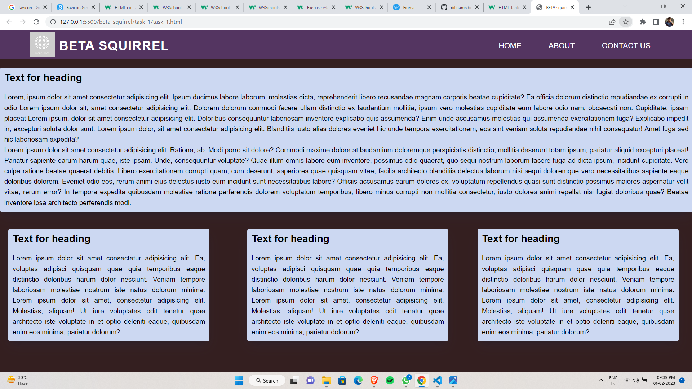
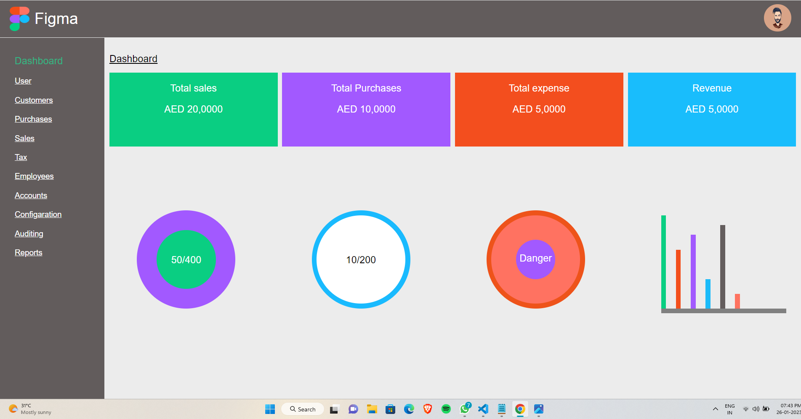

# beta-squirrel

Assignment from betasquirrel

## Task-1

| Requirements              | Output                |
| ------------------------- | --------------------- |
|  |  |
|  |  |
|  |  |

## Reading tasks

- [Home](https://www.w3schools.com/html/default.asp)
- [Introduction](https://www.w3schools.com/html/html_intro.asp)
- [Editors](https://www.w3schools.com/html/html_editors.asp)
- [Basics](https://www.w3schools.com/html/html_basic.asp)
- [Elements](https://www.w3schools.com/html/html_elements.asp)
- [Attributes](https://www.w3schools.com/html/html_attributes.asp)
- [Heading](https://www.w3schools.com/html/html_headings.asp)
- [Paragraph](https://www.w3schools.com/html/html_paragraphs.asp)
- [Styles](https://www.w3schools.com/html/html_styles.asp)
- [Formatting](https://www.w3schools.com/html/html_formatting.asp)
- [Quatation](https://www.w3schools.com/html/html_quotation_elements.asp)
- [Comments](https://www.w3schools.com/html/html_comments.asp)
- [Colors](https://www.w3schools.com/html/html_colors.asp)
- [Css](https://www.w3schools.com/html/html_css.asp)
- [Links](https://www.w3schools.com/html/html_links.asp)
- [Images](https://www.w3schools.com/html/html_images.asp)
- [Favicon](https://www.w3schools.com/html/html_favicon.asp)
- [Tables](https://www.w3schools.com/html/html_tables.asp)

## Exercise-Quiz
.png)
.png)

## Completed tasks

- `task-1` completed
- `task-2` completed
- `task-3` completed
- `task-4` completed
